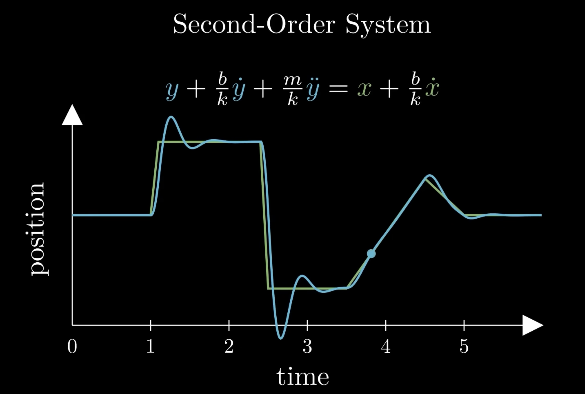
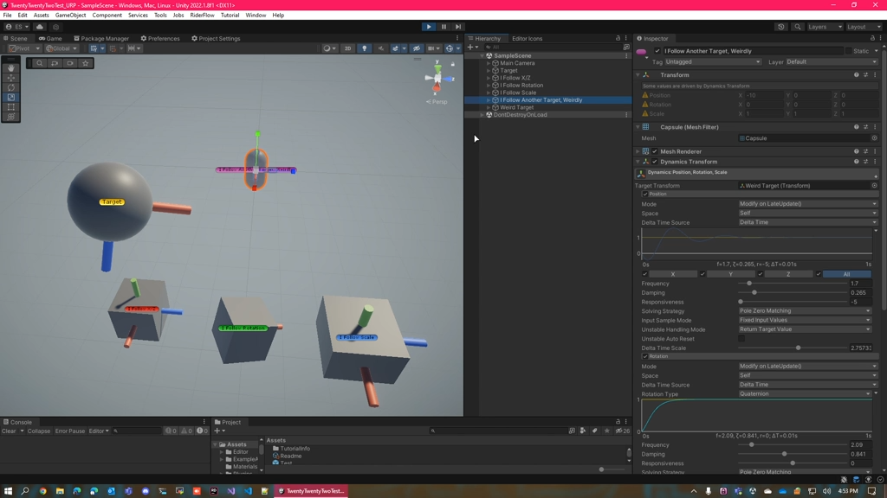

## Description

Damper function to smoothen movement.
Currently, there are 4 implements to choose, they are:

- Second Order System implement described in this [video](https://www.youtube.com/watch?v=KPoeNZZ6H4s&list=LL&index=103&t=97s&ab_channel=t3ssel8r). 

- The other implement of the algorithm above authored by @cmdwtf. [Github](https://github.com/cmdwtf/UnityTools) 

- rewrite based on vvvv's Damper code
- unity-spring authored by thammin. [Github](https://github.com/thammin/unity-spring)